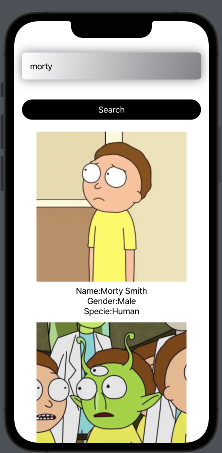
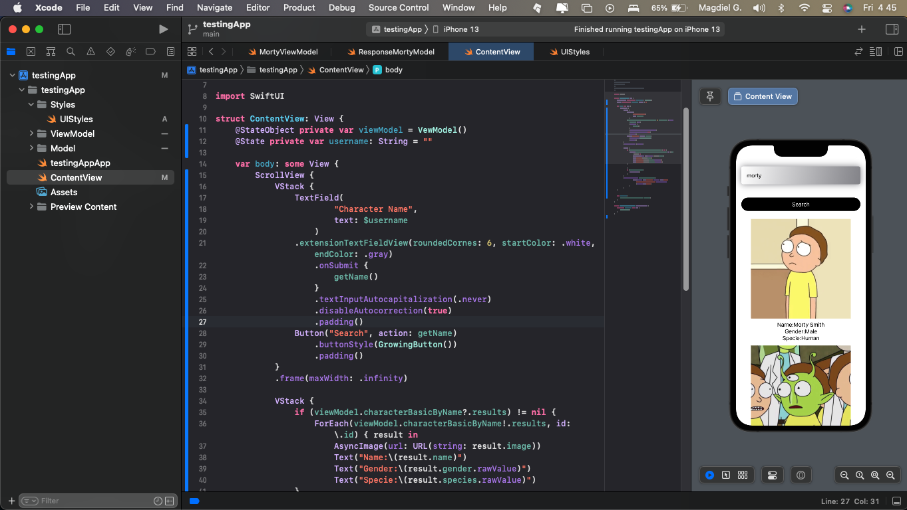

# Rick and Morty Character Search App

This is a simple iOS app built using Swift and SwiftUI that allows you to search for characters from the popular TV show Rick and Morty using the Rick and Morty API.

## Features

- Search characters by name
- Display character information such as name, status, species, gender, and image

## Screenshots

 

## Technologies Used

- Swift
- SwiftUI
- URLSession for network requests
- JSONDecoder for JSON parsing
- AsyncImage for loading and displaying images asynchronously

## API

This app utilizes the Rick and Morty API to fetch character data. The API provides a `/character` endpoint that allows you to search for characters by name. The response includes information such as the character's name, status, species, gender, and image URL.

To fetch character data, the app makes an HTTP request to the API's `/character` endpoint with the specified character name as a query parameter.

Example API request:
```
GET https://rickandmortyapi.com/api/character?name={character_name}
```

Example API response:
```json
{
  "results": [
    {
      "id": 1,
      "name": "Rick Sanchez",
      "status": "Alive",
      "species": "Human",
      "gender": "Male",
      "image": "https://rickandmortyapi.com/api/character/avatar/1.jpeg"
    },
    ...
  ]
}
```

## Usage

To run the app, follow these steps:

1. Clone the repository.
2. Open the project in Xcode.
3. Build and run the app on the simulator or a physical device.

## Contributions

Contributions are welcome! If you find any issues or would like to add new features to the app, feel free to open an issue or submit a pull request.

## License

This project is licensed under the [MIT License](LICENSE).

---

Enjoy searching for your favorite Rick and Morty characters using this app! If you have any questions or feedback, please let me know.
